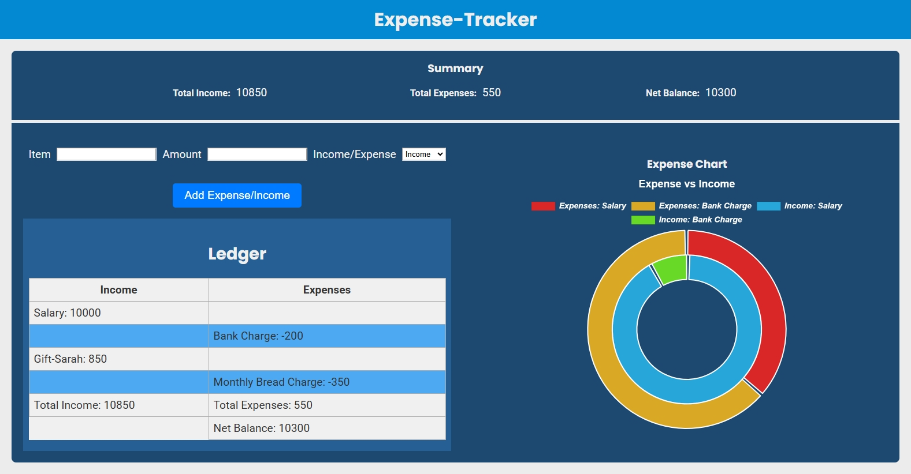

# Expense Tracker

A simple **personal finance tracker** built with **Angular**.  
This project demonstrates how to manage income and expenses using **object arrays** and Angular’s **Signal Store** for state management. It provides a clean UI to add transactions, view summaries, and visualize data with charts.

---

## ✨ Features
- **Add Transactions**: Record income or expenses with item name and amount.
- **Summary Section**: Displays total income, total expenses, and net balance.
- **Ledger Table**: Lists all transactions in a clear, tabular format.
- **Expense Chart**: Visualizes proportions of income vs. expenses using Chart.js.
- **Signal Store Integration**: Reactive state management for a smooth Angular experience.
- **Dark/Light Theme Ready**: Easily adaptable to different UI themes.

---

## 🛠 Tech Stack
- **Angular** (latest version)
- **Chart.js** for data visualization
- **Signal Store** for state management
- **TypeScript** for strong typing
- **SCSS/CSS** for styling

---

## 💻 Screenshot



## 📂 Project Structure
```
src/
├── app/
│    ├── services/        # Signal store and chart service
│    ├── components/      # Summary, Ledger, Chart components
│    ├── models/          # Transaction object interfaces
│    └── app.component.ts # Root component
└── assets/               # Static assets
```

---

## 🚀 Getting Started
### Installation

```bash
git clone <repository-url>
cd expense-tracker
npm install
```

### Usage

```bash
npm start
```
```python
Open http://localhost:4200 in your browser.
```
## Technologies

<!-- - Node.js / React / Python (adjust based on your stack)
- Database: SQLite / MongoDB (adjust as needed) -->
- Demo stack: Object Array, Signal Store

## 🗺 Roadmap
✅ Basic income/expense tracking

✅ Chart.js integration

✅ Signal Store state management

🔜 Database integration (e.g., Firebase, Supabase, or SQL backend)

🔜 Authentication for multiple users

🔜 Export/Import functionality (CSV/Excel)


## 👤 Author

<h3>Goitseone Kau</h3>

Location: Pretoria, South Africa

Role: Developer & Computer Technician

Skills: Angular, UI/UX, Web Development, Signal Store, Chart.js

Contact: LinkedIn (linkedin.com in Bing) | Email (example.com in Bing)

## 🤝 Contributing

This is a **personal project** developed and maintained solely by **Goitseone Kau**.  
At this stage, external contributions are not accepted. The repository serves as a portfolio and demonstration of Angular, Signal Store, and Chart.js integration.

Future updates (such as database functionality) will continue to be authored and managed by the project owner.


## License

MIT License - see LICENSE file for details